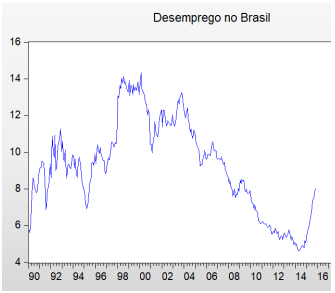
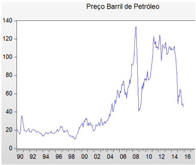
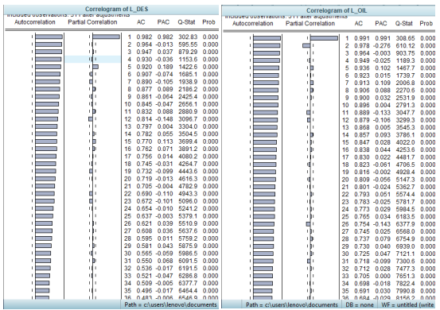
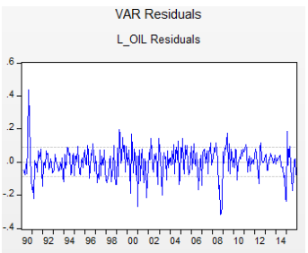

# econometria-eviews
Econometrics using the Eviews. Not my favorite platform, but it worked for solving my problem- measuring the impact of oil prices on employment
 I also included some R to show some of the regression properties that I needed
**OBS: it is written in brazilian portuguese!**
some pictures from, inside are : 
1- the mais graphs that we are interested  
  
  
2- the ACF and PACF:  
  
3- the residuals from VAR:   
  
